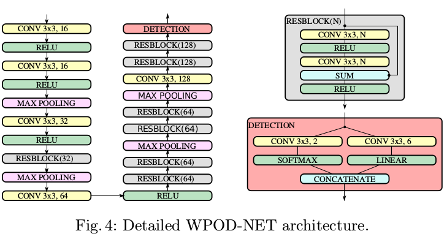
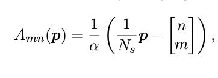

# ALPR unconstrained 论文阅读总结和讨论

look for [papers for alpr](./alpr.pdf)
contributer : [leoluopy](https://github.com/leoluopy)

+ 欢迎提issue.
+ 欢迎watch ，star，实时讨论前沿分享
+ 欢迎加入分享：联系微信：leoluopy

# Overview
+ 
+ 来自ECCV2018，提出了一个整套车牌检测，分割，字符识别方案。【很多论文只是这个pipeline其中一部分】
+ 目前大多数方案对于车牌的识别假设车牌正对，或者倾斜角不大。本文提出了WPOD-Net解决车牌倾斜。
+ 本文提供了，倾斜数据、手工标注数据集及合成数据方法（训练集：196张手标数据集） [ 测试集： 102 张困难 倾斜数据集。]
+ 性能上，特定场景和商业持平，非限定场景超过商业系统。
+ 独立测试集表现出强泛化能力。

## 结构综述 【pipeline 总体流程】
+ 
+ 第一步：车辆检测[YOLOV2](../yolo/yolo2/yolo2_discussing.md)
+ 第二步：WPOD-Net 车牌检测，及车牌矫正 （本文重点贡献）
+ 第三步：OCR 车牌识别 （它是巴西车牌，我们这里不关注）

## WPOD-Net 处理流及网络结构
### RESIZE 预处理
+ resize已经检测出的车辆
+ 
+ 在resize图片采用了如下思路：
> 在车牌无倾角时，往往车牌有足够的像素用于车牌识别，但是车辆照片有倾斜度时，车牌和车辆比例会减小不少，这不利于车牌的提取。
基于此，作者使用此思路来提高，在车辆照片有角度时，放大图片，以放大车牌像素。而在车辆照片像素本来就很大时，采用了Max=608做了相应的缩小。
+ 参考代码 【以下代码是公式的实现】：
+ 
+ 
> 双* 号是指数操作

> 双冒号代表list中取元素位置和步长。

> 同时，代码中做了 对16可整除的对齐操作（为适配后面WpodNet卷积）

### WPOD-Net 结构
+ 
+ > WPOD-Net 是一个全卷积网络，可以输入任意尺寸的图片（但是需要能整除16），最后生成Ns/16 的特征图。特征图上每个点八个通道tensor如下：

（m,n,8） : m,n 是 特征图长宽，有车牌confidence ， 无车牌confidence ， 6个二维仿射变换参数。
+ 
> 网络如上图所示，总共由21个卷积层组成，14个卷积层在resblock中，所有的卷积核都为3x3.他们都使用了RELU作为激活函数，
只有在仿射变换参数的激活中采用了LINEAR（f(x)=x）。网络一共有4个最大池化层，也就是输入图片缩放尺度为:16.

## WPOD-Net Loss 设计

> 全局loss由两部分构成，有无对象置信度loss和仿射变换参数loss。如上图所示。
+ 置信度loss采用类似于SSD中对数loss的设计方法见下图：

+ 仿射变换loss由两部分组成

> Tmn： 其中q是基于原点的单位矩阵。

> Tmn： max(v, 0) 是仿射变换数学性质中保证没有异常的镜像和旋转。

> Tmn： v3,v4,v5,v6 负责形状变换，v7，v8是bias负责少量平移

> Amn： 其中p是gt，是标注车牌的8个点。

> Amn: Ns 是缩放因子，如果网络是4层最大池化，Ns = 2 ** 4 = 16

> Amn: m和n是原图经过特征提取后得到的特征图cell。

> Amn: a 是经验参数，目的是将按照特征图比例缩放和平移后的 车牌形状能更加贴近缩放到单位矩阵尺寸的车牌大小。

TODO： loss 代码。

## WPOD-Net 数据增广及训练方法

## 整体系统 结果对比

