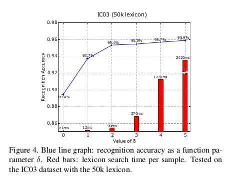

# CRNN 论文阅读总结和讨论

look for [papers for crnn](./pami2015_crnn.pdf)
contributer : [leoluopy](https://github.com/leoluopy)

+ 欢迎提issue.欢迎watch ，star.
+ 微信号：leoluopy
+ 关注AI前沿技术及商业落地，欢迎交流

# Overview
+ 端到端的训练，不需要分模块训练 【无需，手工提取的特征，比如HOG特征，或者图像前处理。】
+ 随意的长度,标注不需要对齐.  【流行的 DCNN 是固定长度的】，。
+ 不需要预定义字典，在固定字典和非固定字典场景表现良好
+ 模型小,权重共享，没有全连接层
> 权重共享是CNN的特性

> 全连接层是主要的权重参数来源这里没有全连接层，减少大量参数。

> 在之前也有很多方法：例如单独字符定位然后用分类器来分类。也有使用RNN来记忆前后信息关联性识别字符。
但RNN 不能 End2end training，基本需要手工提取特征例如HUG特征等。
还有通过CNN提取特征，映射相应特征到字典，这将问题转换为检索问题。
## 性能对比

> 50 ， 1k ，50k ，Full 代表使用的字典中单词数目， None表示不使用字典。

> 符号 - 表示网络模型不支持，或者没有报告结果
## 结构综述 【pipeline 总体流程】
+ 
> 整体网络由三部分组成，第一部分卷积网络提取图像特征，第二部分是RNN双向lstm使用提取的特征来计算字符序列。
第三部分转换层，对字符串序列进行精加工计算最后的输出识别结果（也是字符串）
+  
> maps: filter数目，k：卷积核长宽，s：步长stride，p：padding像素数

### CNN 特征提取
+ 

### RNN 结构
+ 

### Translation 层

### 特性对比

## loss设计

## 超参及训练方法

